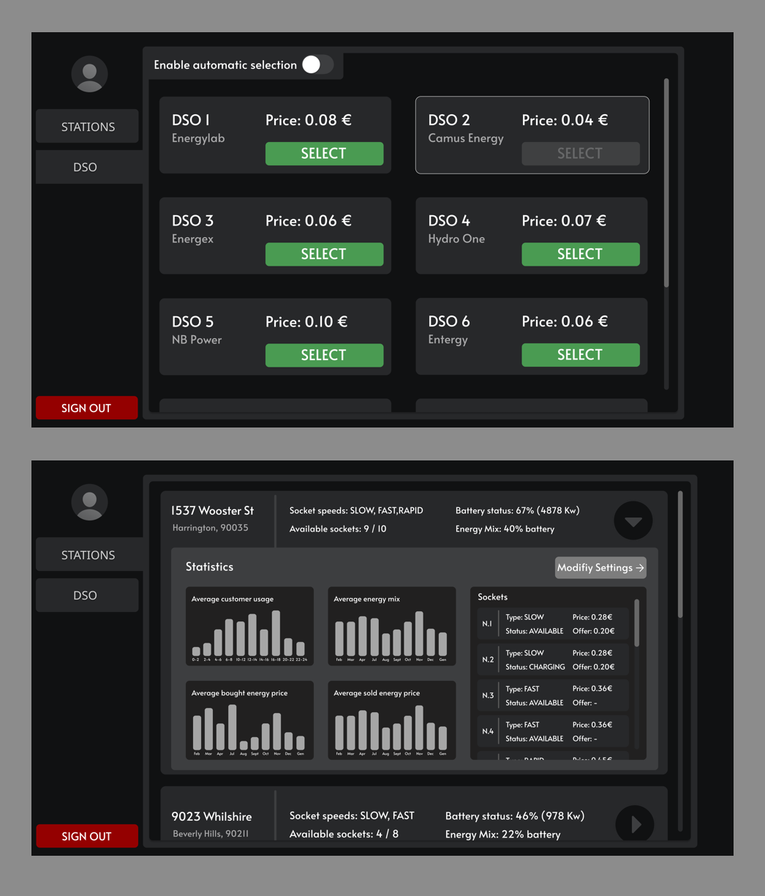

# eMall - EV Charging Station Management System

This project is being developed as a final project for the Software Engineering 2 exam at Politecnico di Milano for the 2022-2023 academic year.

Grade: 30/30

## Introduction

### Purpose

eMall provides a solution for finding available electric vehicle (EV) charging stations and managing the booking process. The system allows users to reserve charging spots and receive personalized recommendations. eMall consists of two main subsystems: **eMSP** (Electric Mobility Service Provider), which interacts with drivers and administrators, and **CPMS** (Charging Point Management System), which provides charging station data using the OCPI 2.2.1 protocol.

### Scope

This document outlines two main actors:
- **Driver**: The end-user who interacts with the system to find and book charging spots.
- **Administrator**: A user responsible for monitoring and managing the system's operation.

## System Overview

### Key Features

- **EV Charging Station Locator**: Locate available charging stations in real-time.
- **Reservation System**: Book a charging spot for a specific time.
- **Proactive Suggestions**: Personalized recommendations based on user behavior.

### Subsystems

1. **eMSP (Electric Mobility Service Provider)**: 
   - Manages user interactions, including driver and administrator requests.
   - Provides services like station reservation, profile management, and notifications.

2. **CPMS (Charging Point Management System)**:
   - Communicates with the eMSP to manage charging station data and reservation information.
   - Supports external API integrations, including DSO settings and station management.

### Administrative Functions

Administrators can manage **DSO settings**, view **charging station data**, and monitor the **system's health**. The system’s **eMSP subsystem** includes a **DSO Manager** that provides views for administrators to manage DSO configurations.

### API Integrations

- **eMSP API**: Facilitates communication between eMSP and CPMS to share station data and reservation information.
- **Payment API**: Handles user payment transactions.
- **Map API**: Integrates with device maps for station location services.
- **Vehicle API**: Retrieves user vehicle data, including battery status and socket type.
- **GPS API**: Accesses user GPS data for location tracking.
- **Notification API**: Sends alerts to users about their reservations and charging status.
- **Calendar API**: Used for managing user schedules to recommend optimal charging times.

## System Architecture

eMall follows a **three-tier architecture**:
1. **Presentation Layer**: Handles user interaction and interfaces with mobile and web clients.
2. **Business Logic Layer**: Manages operations like station reservations, charging status, and recommendations.
3. **Data Layer**: Manages data access and storage via interfaces to various APIs.

## User Interface

Mockups have been designed to illustrate the user experience for both **Drivers** and **Administrators**. These mockups ensure that the interface is user-friendly and accessible.

  
  

## Group components
- [_Roberto Cialini_](https://github.com/RobertoCialini)
- [_Umberto Colangelo_](https://github.com/umbertocolangelo)
- [_Vittorio La Ferla_](https://github.com/vittoriolaferla)
